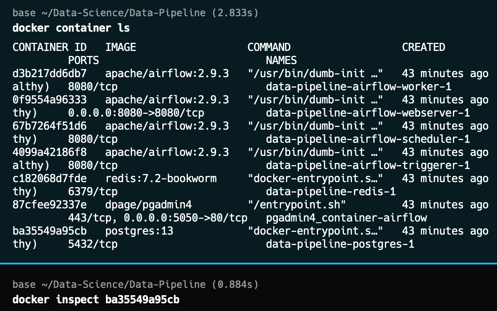
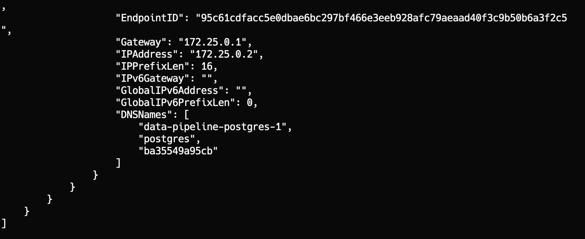
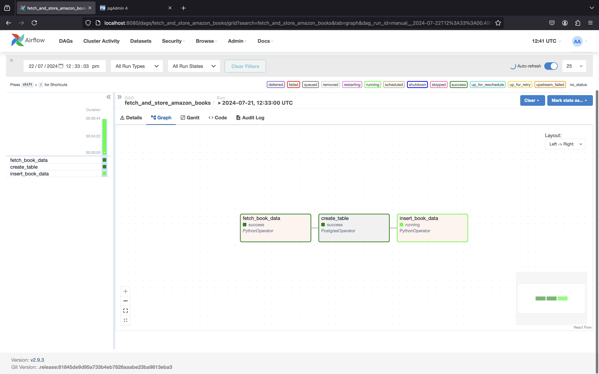
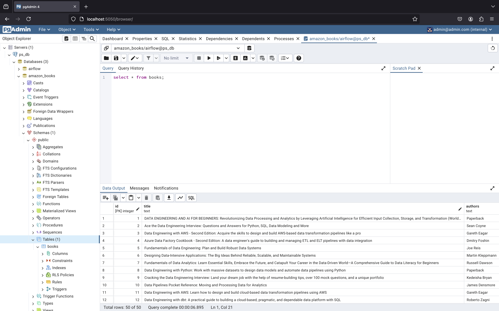

### Airflow ETL Pipeline Setup with Docker Compose
#### Data Engineering Pipeline using Apache Airflow


#### Pipeline Design


# Amazon Books Data Pipeline

This project sets up a data pipeline using Docker containers for PostgreSQL, PGAdmin, and Airflow. The pipeline fetches Amazon books data, processes it, and stores it in a PostgreSQL database.

## Tech Stack


- Docker
- Docker Compose
- Airflow
- PGAdmin
- PostgreSQL
- Python


#### Overview

This guide explains how to set up an ETL pipeline using Airflow and Docker Compose to extract Amazon books data, transform it, and load it into a PostgreSQL database.

#### Steps

1. **Fetch `docker-compose.yaml`**
   ```bash
   curl -LfO 'https://airflow.apache.org/docs/apache-airflow/2.9.3/docker-compose.yaml'
   ```

     **Initialize Environment**
   ```bash
   mkdir -p ./dags ./logs ./plugins ./config
   echo -e "AIRFLOW_UID=$(id -u)" > .env
   docker compose up airflow-init
   ```


2. **PostgreSQL and PGAdmin Configuration** 

##### Add this to the docker compose file to get the WebView of PG Admin 
   ```yaml
   pgadmin:
     container_name: pgadmin4_container-airflow
     image: dpage/pgadmin4
     restart: always
     environment:
       PGADMIN_DEFAULT_EMAIL: admin@admin.com
       PGADMIN_DEFAULT_PASSWORD: root
     ports:
       - "5050:80"
   ```


#### And Then restart it by **Docker Compose Down** 

4. **Start Airflow Services**
   ```bash
   docker compose up
   ```


##### After Initializing Postgres and Pgadmin :
##### 1) Check you running docker containers and then inspect the container to get the IpAddress



## Now Copy Ipaddress from here and go Pgadmin 

### Connecting PostgreSQL to PGAdmin and Airflow

To establish connections between PostgreSQL, PGAdmin, and Airflow using Docker:

 **Configure PGAdmin**
   - Open PGAdmin in your browser (`http://localhost:5050`).
   - Add a new server with the following details:
     - **Name**: `PostgreSQL Server`
     - **Host**: `<IP_address_from_docker_inspect>`
     - **Port**: `5432`
     - **Username**: `airflow`
     - **Password**: `airflow`

 **Configure Airflow Connection**
   - Access Airflow Web UI (`http://localhost:8080`).
   - Go to `Admin -> Connections`.
   - Add a new connection with the following details:
     - **Conn Id**: `fetch_and_store_amazon_books`
     - **Conn Type**: `Postgres`
     - **Host**: `<IP_address_from_docker_inspect>`
     - **Login**: `airflow`
     - **Password**: `airflow`
     - **Port**: `5432`

 **Verify DAG Execution**
   - In Airflow, check the DAG named `fetch_and_store_amazon_books`.
   - Trigger the DAG and monitor its execution to ensure the data pipeline works correctly.


These steps ensure seamless communication between PostgreSQL, PGAdmin, and Airflow, facilitating the management and execution of ETL workflows.

### 5. Verify DAG Execution

1. Go to Airflow's `DAGs` section and look for `fetch_and_store_amazon_books`.
2. Trigger the DAG and monitor its execution.
   
   

##### Once the DAG is verified, you don't need to manage the Python file separately; simply save the DAG configuration in Airflow, and it will be properly handled. This pipeline fetches Amazon books data every 24 hours and populates the PostgreSQL database.


### 6. Check Data in PGAdmin

1. Open PGAdmin and refresh the database `Amazon_books`.
2. Use the Query Tool to run:

```sql
SELECT * FROM books;
```

You should see the Amazon books data stored in the table.


#### Directory Structure
- `./dags` - DAG files
- `./logs` - Task execution logs
- `./plugins` - Custom plugins
- `./config` - Configuration files

- **Source**: Amazon website
- **ETL Process**:
  - **Extract**: Web scraping with Python
  - **Transform**: Data cleaning using SQL
  - **Load**: Store data in PostgreSQL
- **Target**: Structured, Unstructured, Hybrid data

This setup allows for automated workflows managed by Airflow, executed within Docker containers for easy deployment and scaling.


## Additional Notes

- Ensure all Docker containers for PostgreSQL, PGAdmin, and Airflow are running and networked correctly.
- For production, consider deploying on cloud services like AWS EC2.
- Extend the project by adding features such as book descriptions and reviews.


